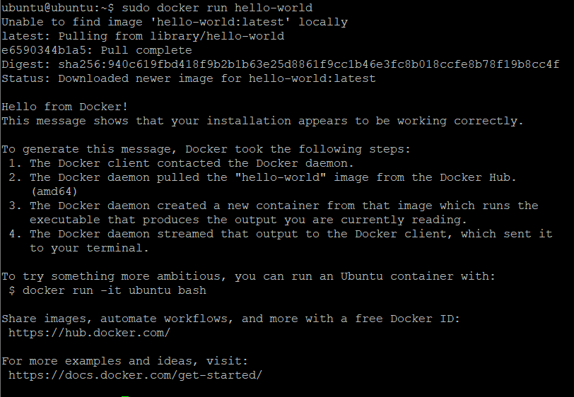

# Portada  


### Asignatura: Automatización de Infraestructura Digital 1  
### Unidad I: Entornos de desarrollo en la automatización de redes  
### Informe sobre la instalación y configuración de herramientas para la automatización de redes  
### Profesor: Eric Domenzain Morales  
### Alumno: Antonio Uribe Ramirez  
### Fecha: 11/06/2025  

---

# Introducción  
Este informe tiene como objetivo detallar el proceso de instalación, configuración y uso inicial de herramientas clave en el entorno de desarrollo moderno y la automatización basada en contenedores. Se examinan las funciones de **Visual Studio Code (VSCode)**, un editor ligero pero potente, y **Git**, junto con su uso en la plataforma **GitHub**. Ambos forman la base para el trabajo colaborativo y el control de versiones.

Más adelante, se introduce **Docker** como solución para contenerización de aplicaciones, explicando su arquitectura, así como las utilidades de **Docker Engine** y **Docker Compose** para implementar servicios distribuidos. También se revisa **Swagger (OpenAPI)** como herramienta de documentación y prueba de APIs REST.  

El propósito del documento es ofrecer una guía clara, práctica y completa para establecer un entorno de desarrollo reproducible y eficiente.

---

# Descripción de las herramientas

## Visual Studio Code  
VSCode es un editor de texto avanzado desarrollado por Microsoft, compatible con múltiples plataformas y lenguajes de programación. Se destaca por su integración con Git, su soporte extensible mediante plugins y su enfoque en la productividad del desarrollador.

## Git  
Git es un sistema de control de versiones distribuido que permite rastrear y gestionar cambios en proyectos de desarrollo. Facilita el trabajo colaborativo y la recuperación de versiones previas.

## GitHub  
GitHub es una plataforma web que permite almacenar y gestionar proyectos basados en Git. Ofrece funcionalidades para la colaboración en línea, como pull requests, revisión de código, seguimiento de incidencias y automatización de flujos de trabajo.

## Docker  
Docker es una tecnología que permite empaquetar y ejecutar aplicaciones en contenedores. Los contenedores encapsulan tanto la aplicación como sus dependencias, garantizando portabilidad y consistencia.

- **Docker Engine:** Es el componente central de Docker, responsable de la ejecución y gestión de contenedores.  
- **Docker Compose:** Permite definir entornos multi-contenedor a través de archivos YAML.  
- **Swagger (OpenAPI):** Herramienta para documentar y probar APIs REST. Generalmente se integra en entornos contenerizados para facilitar la interacción con servicios web.

---

# Procedimiento de instalación

## Visual Studio Code

### Requisitos  
- Sistema operativo compatible (Windows, macOS, Linux)  
- Conexión a Internet  
- Privilegios de administrador  

### Instalación  
1. Acceder a [https://code.visualstudio.com/](https://code.visualstudio.com/)  
2. Descargar la versión correspondiente al sistema operativo  
3. Ejecutar el instalador y seguir las instrucciones recomendadas

---

## Git

### Requisitos  
- Windows 7 o superior  
- Acceso a Internet  
- Permisos administrativos  

### Instalación  
1. Ingresar a [https://git-scm.com/](https://git-scm.com/)  
2. Descargar el archivo ejecutable  
3. Ejecutar el instalador y aceptar la configuración recomendada  

### Comandos básicos
```shell
git config --global user.name "Tu Nombre"
git config --global user.email "tuemail@dominio.com"
git init
git clone https://github.com/usuario/repositorio.git
git status
git add .
git commit -m "Descripción"
git push
git pull
git branch -M main
```

---

## Docker Engine  

La instalación se basa en la guía oficial de [Docker para Ubuntu](https://docs.docker.com/engine/install/ubuntu/)

### Requisitos  
- VM con Ubuntu 22.04 o superior  
- Internet habilitado  

### Instalación  
```shell
sudo apt-get update
sudo apt-get install ca-certificates curl
sudo install -m 0755 -d /etc/apt/keyrings
sudo curl -fsSL https://download.docker.com/linux/ubuntu/gpg -o /etc/apt/keyrings/docker.asc
sudo chmod a+r /etc/apt/keyrings/docker.asc
```

Agregar repositorio:
```shell
echo   "deb [arch=$(dpkg --print-architecture) signed-by=/etc/apt/keyrings/docker.asc] https://download.docker.com/linux/ubuntu   $(. /etc/os-release && echo "${UBUNTU_CODENAME:-$VERSION_CODENAME}") stable" |   sudo tee /etc/apt/sources.list.d/docker.list > /dev/null
sudo apt-get update
```

Instalar Docker:
```shell
sudo apt-get install docker-ce docker-ce-cli containerd.io docker-buildx-plugin docker-compose-plugin
```

### Verificar funcionamiento
```shell
sudo docker run hello-world
```




**Permitir uso sin sudo:**
```shell
sudo groupadd docker
sudo usermod -aG docker $USER
newgrp docker
docker run hello-world
```

---

## Docker Compose con YAML  

### Requisitos  
- Docker Engine activo  
- Red NAT habilitada  

### Configuración
```shell
mkdir mi-proyecto-docker && cd mi-proyecto-docker
mkdir html
echo "<h1> HOLA DESDE DOCKER </h1>" > html/index.html
nano test.yml
```

Contenido de `test.yml`:
```yaml
services:
  web:
    image: nginx:latest
    container_name: mi-nginx
    restart: unless-stopped
    ports:
      - "8080:80"
    volumes:
      - ./html:/usr/share/nginx/html:ro
```

### Levantar contenedor
```shell
docker compose -f test.yml up -d


```


### Verificar
```shell
docker ps -a


```


Navegar a:  
[http://ip-maquina-virtual:8080](http://ip-maquina-virtual:8080)

  


---

### Comandos útiles de Docker  
```shell
docker start [ID]
docker logs [ID]
docker stop [ID]
docker rm [ID]
docker image rm [ID]
docker stats
```

---

# Conclusión  
Este informe ha explorado de forma integral las herramientas fundamentales para configurar un entorno de desarrollo moderno y automatizado. Desde la edición de código y el control de versiones hasta la contenerización de servicios web y la documentación de APIs, cada componente cumple una función esencial en la implementación de flujos de trabajo DevOps.

La instalación guiada, acompañada de comandos prácticos y pruebas funcionales, permite a cualquier desarrollador establecer entornos portables, escalables y reproducibles. El uso combinado de estas tecnologías proporciona una base sólida para proyectos colaborativos, ágiles y eficientes.

---

# Bibliografía  
- Git Documentation: https://git-scm.com/doc  
- NGINX Docs: https://nginx.org/en/docs/  
- Docker Docs: https://docs.docker.com/engine/install/ubuntu/  
- Visual Studio Code: https://code.visualstudio.com/  
